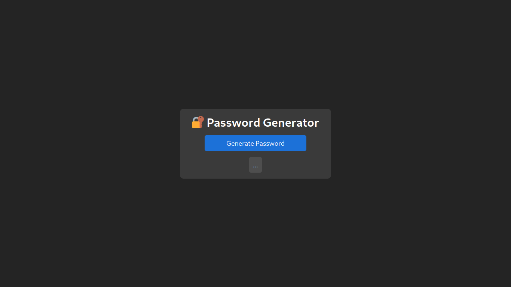

# Project Password Generator

[](https://opensource.org/licenses/ISC)

## Link

## [password-generator.vercel](https://paulo-password-generator.vercel.app/)

## Preview



## About

This is my 10th project during my journey at Trybe!

This is a simple project that was developed using **[Vite](https://vitejs.dev/)** | **[NanoId](https://www.npmjs.com/package/nanoid)** | **[clipboard-copy](https://www.npmjs.com/package/clipboard-copy)**. The main purpose was to get in touch with external libraries and their documentation, learning how to implement them in the code, thus having a wider range of options when developing an app!

## How to Use

### Clone the Repository

```bash
git clone git@github.com:opaulojr/password-generator.git && cd password-generator
```

### Install Dependencies

```bash
npm install
```

### Run the Project

```bash
npm run dev
```

## Repository Structure

- The `src` folder contains all the code

## Implemented Features

### Password Generation

  - There's a button on the page body with the text 'Generate Password' that uses the `nanoid` library to generate passwords
  - After the password is generated, it's displayed below the button
  - Below the password, there's a paragraph with the text 'click to copy', indicating that clicking/tapping it will copy the password to the clipboard
  - Whenever the password is copied, the paragraph text changes from 'click to copy' to 'copied' to indicate that the action was successful

---

### Nanoid Implementation

  - Using the **nanoid** library, it's possible to generate random passwords of 21 characters, including numbers, symbols, lowercase, and uppercase letters, creating passwords that are secure enough

---

### Click To Copy Implementation

  - Using the **clipboard-copy** library, clicking/tapping on the generated password automatically copies it to the clipboard, enhancing the user experience

---
